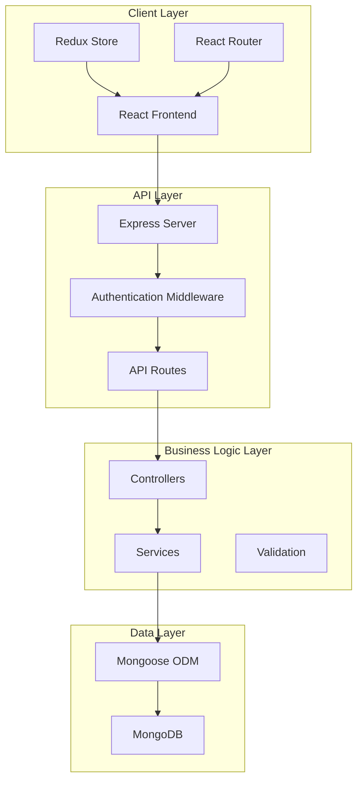

# Design Document

## Overview

This design document outlines the architecture for a full-stack MERN e-commerce application. The system follows a modern microservices-inspired architecture with clear separation between frontend (React), backend (Node.js/Express), and database (MongoDB) layers. The design emphasizes scalability, maintainability, and security while providing a seamless user experience.

## Architecture

### High-Level Architecture



### Technology Stack

**Frontend:**
- React 16.8+ with Hooks
- Redux for state management
- React Router for navigation
- Axios for API communication
- Bootstrap/Reactstrap for UI components
- Socket.io for real-time features

**Backend:**
- Node.js with Express framework
- MongoDB with Mongoose ODM
- JWT for authentication
- Bcrypt for password hashing
- Multer for file uploads
- Nodemailer for email notifications
- Socket.io for real-time notifications
- Node-cron for scheduled tasks (inventory alerts)

## Components and Interfaces

### Frontend Components Structure

```
src/
├── components/
│   ├── common/
│   │   ├── Header/
│   │   ├── Footer/
│   │   ├── Loading/
│   │   └── ErrorBoundary/
│   ├── product/
│   │   ├── ProductCard/
│   │   ├── ProductList/
│   │   ├── ProductDetail/
│   │   └── ProductSearch/
│   ├── cart/
│   │   ├── CartItem/
│   │   ├── CartSummary/
│   │   └── CartDrawer/
│   ├── user/
│   │   ├── LoginForm/
│   │   ├── RegisterForm/
│   │   ├── Profile/
│   │   └── OrderHistory/
│   ├── checkout/
│   │   ├── CheckoutForm/
│   │   ├── PaymentForm/
│   │   └── OrderConfirmation/
│   └── admin/
│       ├── ProductManagement/
│       ├── OrderManagement/
│       └── Dashboard/
├── containers/
├── services/
├── utils/
└── store/
```

### Backend API Structure

```
server/
├── controllers/
│   ├── authController.js
│   ├── productController.js
│   ├── cartController.js
│   ├── orderController.js
│   └── userController.js
├── models/
│   ├── User.js
│   ├── Product.js
│   ├── Cart.js
│   └── Order.js
├── routes/
│   ├── auth.js
│   ├── products.js
│   ├── cart.js
│   ├── orders.js
│   └── users.js
├── middleware/
│   ├── auth.js
│   ├── validation.js
│   └── errorHandler.js
├── services/
│   ├── emailService.js
│   ├── paymentService.js
│   └── uploadService.js
└── utils/
```

### API Endpoints

**Authentication:**
- POST `/api/auth/register` - User registration
- POST `/api/auth/login` - User login
- GET `/api/auth/profile` - Get user profile
- PUT `/api/auth/profile` - Update user profile

**Products:**
- GET `/api/products` - Get all products (with pagination, search, filter)
- GET `/api/products/:id` - Get single product
- POST `/api/products` - Create product (admin only)
- PUT `/api/products/:id` - Update product (admin only)
- DELETE `/api/products/:id` - Delete product (admin only)

**Cart:**
- GET `/api/cart` - Get user's cart
- POST `/api/cart/add` - Add item to cart
- PUT `/api/cart/update` - Update cart item quantity
- DELETE `/api/cart/remove/:productId` - Remove item from cart

**Orders:**
- GET `/api/orders` - Get user's orders
- POST `/api/orders` - Create new order
- GET `/api/orders/:id` - Get order details
- PUT `/api/orders/:id/status` - Update order status (admin only)
- GET `/api/admin/orders` - Get all orders with search/filter (admin only)

**Notifications:**
- POST `/api/notifications/email` - Send email notification
- GET `/api/notifications/status` - Check notification delivery status

## Data Models

### User Model
```javascript
{
  _id: ObjectId,
  name: String,
  email: String (unique),
  password: String (hashed),
  role: String (enum: ['customer', 'admin']),
  address: {
    street: String,
    city: String,
    state: String,
    zipCode: String,
    country: String
  },
  createdAt: Date,
  updatedAt: Date
}
```

### Product Model
```javascript
{
  _id: ObjectId,
  name: String,
  description: String,
  price: Number,
  category: String,
  images: [String],
  inventory: Number,
  rating: Number,
  numReviews: Number,
  reviews: [{
    user: ObjectId (ref: User),
    rating: Number,
    comment: String,
    createdAt: Date
  }],
  createdAt: Date,
  updatedAt: Date
}
```

### Cart Model
```javascript
{
  _id: ObjectId,
  user: ObjectId (ref: User),
  items: [{
    product: ObjectId (ref: Product),
    quantity: Number,
    price: Number
  }],
  totalAmount: Number,
  createdAt: Date,
  updatedAt: Date
}
```

### Order Model
```javascript
{
  _id: ObjectId,
  user: ObjectId (ref: User),
  items: [{
    product: ObjectId (ref: Product),
    name: String,
    quantity: Number,
    price: Number
  }],
  shippingAddress: {
    street: String,
    city: String,
    state: String,
    zipCode: String,
    country: String
  },
  paymentMethod: String,
  paymentResult: {
    id: String,
    status: String,
    updateTime: String,
    emailAddress: String
  },
  totalAmount: Number,
  status: String (enum: ['pending', 'processing', 'shipped', 'delivered', 'cancelled']),
  createdAt: Date,
  updatedAt: Date
}
```

## Error Handling

### Frontend Error Handling
- Global error boundary for React component errors
- Redux error states for API failures
- User-friendly error messages and fallback UI
- Loading states during API calls
- Form validation with real-time feedback

### Backend Error Handling
- Centralized error handling middleware
- Structured error responses with consistent format
- Input validation using express-validator
- Database error handling with meaningful messages
- Authentication and authorization error responses

### Error Response Format
```javascript
{
  success: false,
  error: {
    message: "Error description",
    code: "ERROR_CODE",
    details: {} // Additional error details if needed
  }
}
```

## Testing Strategy

### Frontend Testing
- Unit tests for components using Jest and React Testing Library
- Integration tests for Redux actions and reducers
- End-to-end tests using Cypress for critical user flows
- Visual regression testing for UI components

### Backend Testing
- Unit tests for controllers and services using Jest
- Integration tests for API endpoints using Supertest
- Database testing with test database setup/teardown
- Authentication and authorization testing

### Test Coverage Goals
- Minimum 80% code coverage for critical business logic
- 100% coverage for authentication and payment flows
- Automated testing in CI/CD pipeline

## Security Considerations

### Authentication & Authorization
- JWT tokens with appropriate expiration times
- Password hashing using bcrypt with salt rounds
- Role-based access control for admin features
- Protected routes on both frontend and backend

### Data Protection
- Input validation and sanitization
- SQL injection prevention through Mongoose
- XSS protection with proper data encoding
- CORS configuration for API access
- Rate limiting for API endpoints

### Payment Security
- PCI DSS compliance considerations
- Secure payment processing integration
- Encrypted storage of sensitive data
- Audit logging for financial transactions

## Notification System Architecture

### Email Notification Service
The system implements a comprehensive email notification service to keep customers informed throughout their shopping journey:

**Design Rationale:** Email notifications are critical for customer engagement and order transparency. The service is designed with reliability and retry mechanisms to ensure delivery.

**Components:**
- **Email Service**: Centralized service using Nodemailer with SMTP configuration
- **Template Engine**: HTML email templates for different notification types
- **Queue System**: Email queue with retry logic for failed deliveries
- **Notification Controller**: API endpoints for triggering and tracking notifications

**Notification Types:**
- Order confirmation emails (Requirement 7.1)
- Order status update notifications (Requirement 7.2)
- Shipping notifications with tracking info (Requirement 7.3)
- Error and issue alerts (Requirement 7.4)
- Low inventory alerts for administrators (Requirement 5.5)

**Error Handling:**
- Failed email delivery logging and retry attempts (Requirement 7.5)
- Fallback notification methods for critical updates
- Admin dashboard for monitoring notification delivery status

### Real-time Notification System
**Design Rationale:** Real-time updates enhance user experience by providing immediate feedback on order status changes and inventory updates.

**Implementation:**
- Socket.io integration for real-time communication
- Event-driven architecture for order status updates
- Real-time inventory notifications for administrators
- Connection management and authentication for socket connections

## Search and Filtering Architecture

### Product Search System
**Design Rationale:** Robust search functionality is essential for product discovery and user experience. The system supports multiple search methods to accommodate different user behaviors.

**Search Capabilities:**
- Full-text search across product name, description, and category (Requirement 1.2)
- Category-based filtering (Requirement 1.3)
- Price range filtering and sorting options (Requirement 1.4)
- Featured products display on homepage (Requirement 1.1)

**Technical Implementation:**
- MongoDB text indexes for efficient full-text search
- Aggregation pipelines for complex filtering
- Pagination for large result sets
- Search result caching for performance optimization

**Frontend Search Components:**
- Search bar with autocomplete suggestions
- Advanced filter sidebar with category, price, and rating filters
- Sort options (price, name, rating, date)
- Search results pagination and loading states

## Inventory Management System

### Inventory Tracking
**Design Rationale:** Accurate inventory management prevents overselling and ensures product availability information is always current.

**Core Features:**
- Real-time inventory updates on order completion (Requirement 4.5)
- Low stock threshold monitoring and alerts (Requirement 5.5)
- Inventory validation during checkout process
- Bulk inventory management for administrators

**Implementation Details:**
- Atomic inventory updates using MongoDB transactions
- Scheduled tasks using node-cron for inventory monitoring
- Real-time notifications for low stock alerts
- Inventory history tracking for audit purposes

**Admin Interface:**
- Inventory dashboard with current stock levels (Requirement 5.4)
- Low stock alerts and notifications (Requirement 5.5)
- Bulk inventory update functionality
- Inventory reports and analytics

## Order Management System

### Order Processing Flow
**Design Rationale:** The order system must handle the complete lifecycle from cart to delivery while maintaining data integrity and providing transparency.

**Order Lifecycle:**
1. Cart validation and inventory check
2. Payment processing and verification (Requirement 4.2)
3. Order creation and confirmation email (Requirement 4.3, 7.1)
4. Inventory deduction (Requirement 4.5)
5. Order fulfillment and status updates (Requirement 6.2, 7.2)
6. Shipping notification with tracking (Requirement 6.5, 7.3)

**Admin Order Management:**
- Comprehensive order dashboard with search/filter (Requirement 6.1, 6.3)
- Order status management with customer notifications (Requirement 6.2)
- Detailed order view with customer and shipping information (Requirement 6.4)
- Bulk order processing capabilities

## Performance Optimization

### Frontend Optimization
- Code splitting and lazy loading for routes
- Image optimization and lazy loading
- Redux state normalization
- Memoization for expensive computations
- Bundle size optimization

### Backend Optimization
- Database indexing for frequently queried fields
- Pagination for large data sets
- Caching strategies for product data
- Connection pooling for database
- API response compression

### Database Optimization
- Proper indexing strategy
- Query optimization
- Data aggregation for analytics
- Connection management
- Regular performance monitoring